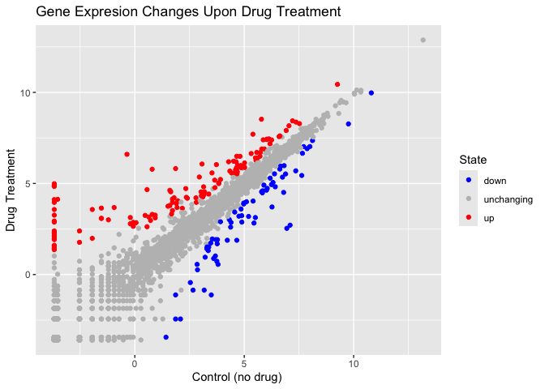

# Class05
Adam Bisharat

\#Q1. For which phases is data visualization important in our scientific
workflows? All of the above

\#Q2. True or False? The ggplot2 package comes already installed with R?
FALSE

\#Q3. Which plot types are typically NOT used to compare distributions
of numeric variables? Network graphs

\#Q4. Which statement about data visualization with ggplot2 is
incorrect? ggplot2 is the only way to create plots in R

\#Q5. Which geometric layer should be used to create scatter plots in
ggplot2? geom_point()

\#Q6. Use the nrow() function to find out how many genes are in this
dataset. What is your answer? 5196

\#Q7. Use the colnames() function and the ncol() function on the genes
data frame to find out what the column names are (we will need these
later) and how many columns there are. How many columns did you find? 4

\#Q8. Use the table() function on the State column of this data.frame to
find out how many ‘up’ regulated genes there are. What is your answer?
127

\#Q9. Using your values above and 2 significant figures. What fraction
of total genes is up-regulated in this dataset? 2.44

Plotting in R R has lots of ways to make plots and figures. This
includes so called base graphics and packages.

``` r
plot(cars)
```


``` r
library(ggplot2)

ggplot(cars)
```


``` r
ggplot(cars) +
  aes(x=speed, y=dist)
```


``` r
ggplot(cars) +
  aes(x=speed, y=dist) +
  geom_point()
```


Q. In your own RStudio can you add a trend line layer to help show the
relationship between the plot variables with the geom_smooth() function?

``` r
ggplot(cars) +
  aes(x=speed, y=dist) +
  geom_point() +
  geom_smooth()
```

    `geom_smooth()` using method = 'loess' and formula = 'y ~ x'


Q. Argue with geom_smooth() to add a straight line from a linear model
without the shaded standard error region?

``` r
ggplot(cars) +
  aes(x=speed, y=dist) +
  geom_point() +
  geom_smooth(method="lm", se=FALSE)
```

    `geom_smooth()` using formula = 'y ~ x'


Q. Can you finish this plot by adding various label annotations with the
labs() function and changing the plot look to a more conservative “black
& white” theme by adding the theme_bw() function:

``` r
ggplot(cars) + 
  aes(x=speed, y=dist) +
  geom_point() +
  labs(title="Speed and Stopping Distances of Cars",
       x="Speed (MPH)", 
       y="Stopping Distance (ft)",
       subtitle = "Your informative subtitle text here",
       caption="Dataset: 'cars'") +
  geom_smooth(method="lm", se=FALSE) +
  theme_bw()
```

    `geom_smooth()` using formula = 'y ~ x'


``` r
url <- "https://bioboot.github.io/bimm143_S20/class-material/up_down_expression.txt"
genes <- read.delim(url)
head(genes)
```

            Gene Condition1 Condition2      State
    1      A4GNT -3.6808610 -3.4401355 unchanging
    2       AAAS  4.5479580  4.3864126 unchanging
    3      AASDH  3.7190695  3.4787276 unchanging
    4       AATF  5.0784720  5.0151916 unchanging
    5       AATK  0.4711421  0.5598642 unchanging
    6 AB015752.4 -3.6808610 -3.5921390 unchanging

Q. Complete the code below to produce the following plot ggplot(***) +
aes(x=Condition1, y=***) * *\_\_\_\_

``` r
ggplot(genes) + 
    aes(x=Condition1, y=Condition2) +
    geom_point()
```


``` r
p <- ggplot(genes) + 
    aes(x=Condition1, y=Condition2, col=State) +
    geom_point()
p
```


``` r
p + scale_colour_manual( values=c("blue","gray","red") )
```


Q. Nice, now add some plot annotations to the p object with the labs()
function so your plot looks like the following:

``` r
p + scale_colour_manual(values=c("blue","gray","red")) +
    labs(title="Gene Expresion Changes Upon Drug Treatment",
         x="Control (no drug) ",
         y="Drug Treatment")
```



``` r
# File location online
url <- "https://raw.githubusercontent.com/jennybc/gapminder/master/inst/extdata/gapminder.tsv"

gapminder <- read.delim(url)
```

``` r
library(dplyr)
```


    Attaching package: 'dplyr'

    The following objects are masked from 'package:stats':

        filter, lag

    The following objects are masked from 'package:base':

        intersect, setdiff, setequal, union

``` r
gapminder_2007 <- gapminder %>% filter(year==2007)
```

Q. Complete the code below to produce a first basic scater plot of this
gapminder_2007 dataset: ggplot(gapminder_2007) + aes(x=***, y=***) +
\_\_\_

``` r
ggplot(gapminder_2007) +
  aes(x=gdpPercap, y=lifeExp) +
  geom_point()
```


``` r
ggplot(gapminder_2007) +
  aes(x=gdpPercap, y=lifeExp) +
  geom_point(alpha=0.5)
```


``` r
ggplot(gapminder_2007) +
  aes(x=gdpPercap, y=lifeExp, color=continent, size=pop) +
  geom_point(alpha=0.5)
```


``` r
ggplot(gapminder_2007) + 
  aes(x = gdpPercap, y = lifeExp, color = pop) +
  geom_point(alpha=0.8)
```


``` r
ggplot(gapminder_2007) + 
  aes(x = gdpPercap, y = lifeExp, size = pop) +
  geom_point(alpha=0.5)
```


``` r
ggplot(gapminder_2007) + 
  geom_point(aes(x = gdpPercap, y = lifeExp,
                 size = pop), alpha=0.5) + 
  scale_size_area(max_size = 10)
```


-Q. Can you adapt the code you have learned thus far to reproduce our
gapminder scatter plot for the year 1957? What do you notice about this
plot is it easy to compare with the one for 2007?

Steps to produce your 1957 plot should include:

Use dplyr to filter the gapmider dataset to include only the year 1957
(check above for how we did this for 2007). Save your result as
gapminder_1957. Use the ggplot() function and specify the gapminder_1957
dataset as input Add a geom_point() layer to the plot and create a
scatter plot showing the GDP per capita gdpPercap on the x-axis and the
life expectancy lifeExp on the y-axis Use the color aesthetic to
indicate each continent by a different color Use the size aesthetic to
adjust the point size by the population pop Use scale_size_area() so
that the point sizes reflect the actual population differences and set
the max_size of each point to 15 -Set the opacity/transparency of each
point to 70% using the alpha=0.7 parameter

``` r
gapminder_1957 <- gapminder %>% filter(year==1957)

ggplot(gapminder_1957) + 
  aes(x = gdpPercap, y = lifeExp, color=continent,
                 size = pop) +
  geom_point(alpha=0.7) + 
  scale_size_area(max_size = 10) 
```


Q. Do the same steps above but include 1957 and 2007 in your input
dataset for ggplot(). You should now include the layer facet_wrap(~year)
to produce the following plot:

``` r
gapminder_1957 <- gapminder %>% filter(year==1957 | year==2007)

ggplot(gapminder_1957) + 
  geom_point(aes(x = gdpPercap, y = lifeExp, color=continent,
                 size = pop), alpha=0.7) + 
  scale_size_area(max_size = 10) +
  facet_wrap(~year)
```


``` r
gapminder_top5 <- gapminder %>% 
  filter(year==2007) %>% 
  arrange(desc(pop)) %>% 
  top_n(5, pop)

gapminder_top5
```

            country continent year lifeExp        pop gdpPercap
    1         China      Asia 2007  72.961 1318683096  4959.115
    2         India      Asia 2007  64.698 1110396331  2452.210
    3 United States  Americas 2007  78.242  301139947 42951.653
    4     Indonesia      Asia 2007  70.650  223547000  3540.652
    5        Brazil  Americas 2007  72.390  190010647  9065.801

``` r
ggplot(gapminder_top5) + 
  geom_col(aes(x = country, y = pop))
```


