# Lab 7: Machine Learning
Adam Bisharat

Today we are going to learn how to apply different machine learning
methods, beginning with clustering:

The goal here is to find groups/clusters in your input data

First I will make up some data with clear groups. For this I will use
the `rnorm()` function:

``` r
rnorm(10)
```

     [1]  0.02599797 -1.89378547  0.41392063 -0.55093264 -0.11877742  0.05145297
     [7]  0.67958567  0.34690899  0.28194717 -0.01341270

``` r
hist(rnorm(10000,3))
```

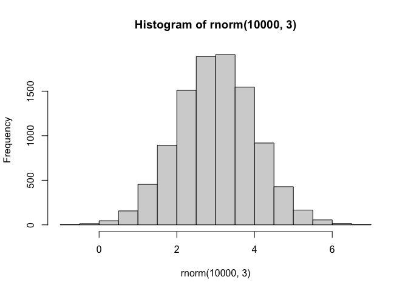

``` r
hist(c(rnorm(10000, -3), rnorm(10000,3)))
```

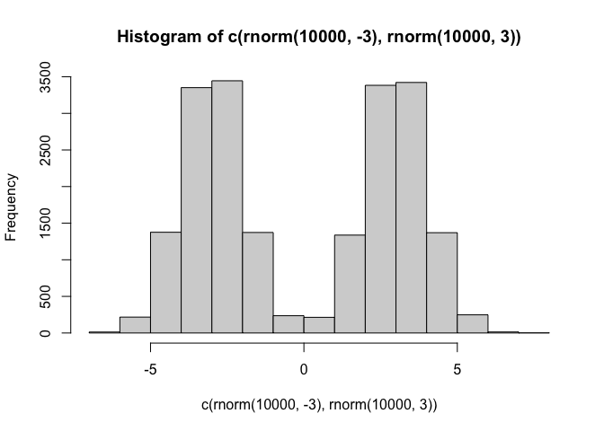

``` r
n <- 10000
x <- c(rnorm(n,-3), rnorm(n,3))
hist(x)
```

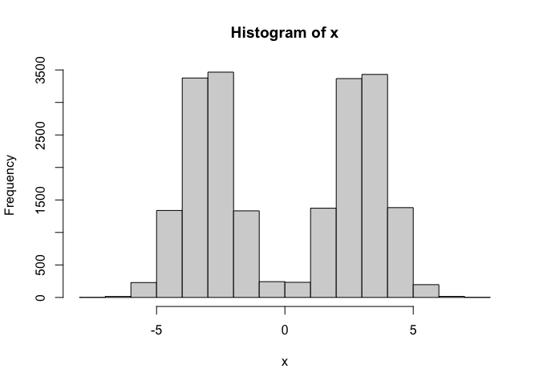

``` r
n <- 30
x <- c(rnorm(n,-3), rnorm(n,3))
hist(x)
```

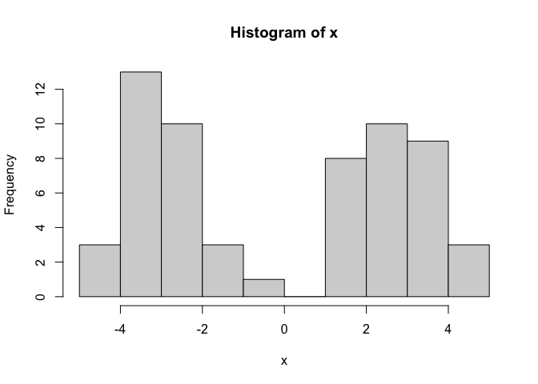

``` r
n <- 30
x <- c(rnorm(n,-3), rnorm(n,3))
y <- rev(x)

z <- cbind(x,y)
head(z)
```

                  x        y
    [1,] -1.9876293 2.785466
    [2,] -2.4799164 1.137338
    [3,] -3.3171547 3.642664
    [4,] -3.8274500 2.300389
    [5,] -3.6296209 2.418969
    [6,] -0.6766383 3.663249

``` r
plot(z)
```

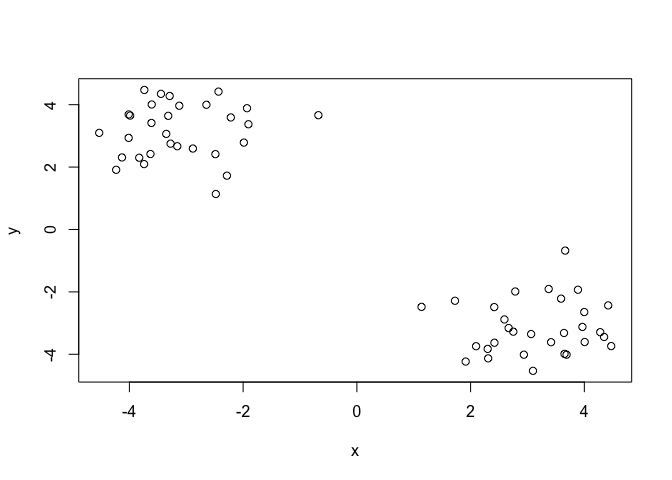

Use the `kmeans()` function setting k to 2 and nstart=20

Inspect/print the results

> Q. How many points are in each cluster?

30 points in each cluster, 60 total

> Q. What ‘component’ of your result object details - cluster size? -
> cluster assignment/membership? - cluster center?

> Q. Plot x colored by the kmeans cluster assignment and add cluster
> centers as blue points

``` r
km <- kmeans(z, centers=2)
km
```

    K-means clustering with 2 clusters of sizes 30, 30

    Cluster means:
              x         y
    1  3.153850 -3.132003
    2 -3.132003  3.153850

    Clustering vector:
     [1] 2 2 2 2 2 2 2 2 2 2 2 2 2 2 2 2 2 2 2 2 2 2 2 2 2 2 2 2 2 2 1 1 1 1 1 1 1 1
    [39] 1 1 1 1 1 1 1 1 1 1 1 1 1 1 1 1 1 1 1 1 1 1

    Within cluster sum of squares by cluster:
    [1] 44.26752 44.26752
     (between_SS / total_SS =  93.1 %)

    Available components:

    [1] "cluster"      "centers"      "totss"        "withinss"     "tot.withinss"
    [6] "betweenss"    "size"         "iter"         "ifault"      

Results in kmeans objects `km`

``` r
attributes(km)
```

    $names
    [1] "cluster"      "centers"      "totss"        "withinss"     "tot.withinss"
    [6] "betweenss"    "size"         "iter"         "ifault"      

    $class
    [1] "kmeans"

Cluster size?

``` r
km$size
```

    [1] 30 30

Cluster Assignment/membership?

``` r
km$cluster
```

     [1] 2 2 2 2 2 2 2 2 2 2 2 2 2 2 2 2 2 2 2 2 2 2 2 2 2 2 2 2 2 2 1 1 1 1 1 1 1 1
    [39] 1 1 1 1 1 1 1 1 1 1 1 1 1 1 1 1 1 1 1 1 1 1

Cluster center?

``` r
km$center
```

              x         y
    1  3.153850 -3.132003
    2 -3.132003  3.153850

Plot x colored by the kmeans cluster assignment and add cluster centers
as blue points

``` r
plot(z, col="red")
```

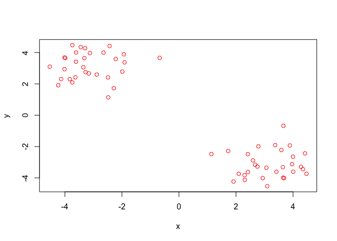

R will recycle the shorter color vector to be the same length as the
longer(number of data points) in z

``` r
plot(z, col=c("red", "blue") )
```

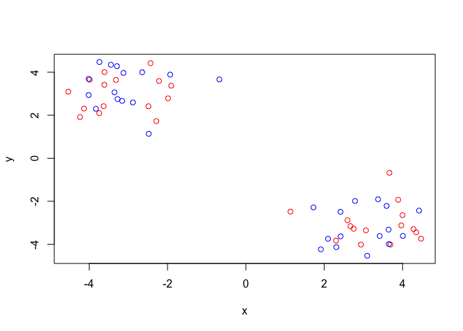

``` r
plot(z, col=c( 1,2) )
```

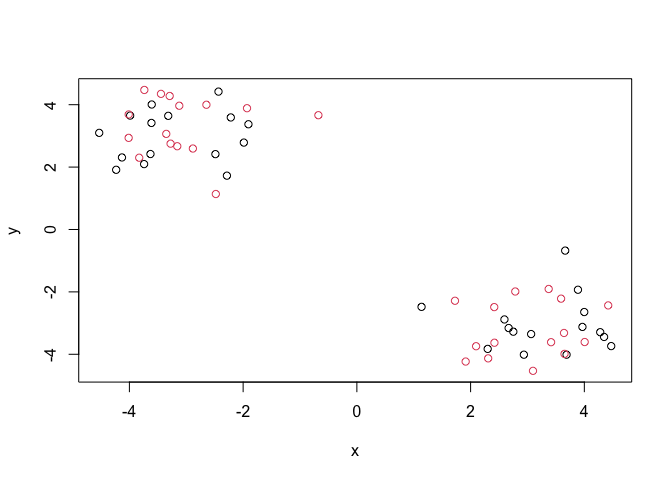

``` r
plot(z, col=km$cluster)
```


We can use the `points()` fucntion to add new points to an existing
plot…like the cluster centers.

``` r
plot(z, col=km$cluster)
points(km$centers, col="blue", pch=15, cex=3)
```

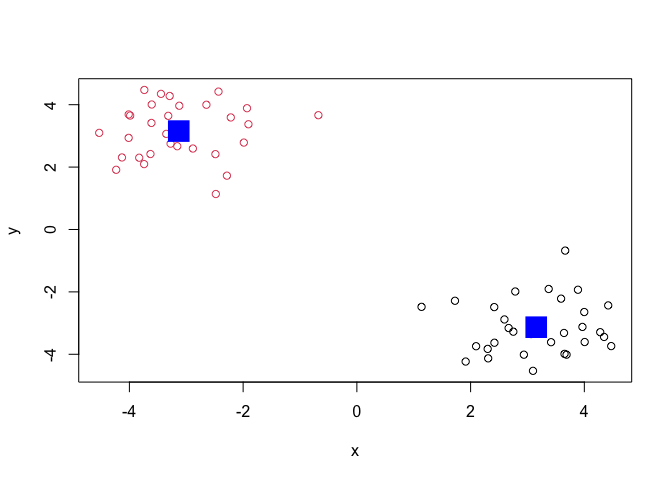

> Q. Can you run kmeans() and ask for 4 clusters please and plot the
> results like we have done above?

``` r
km4 <- kmeans(z, centers=4)
plot(z, col=km$cluster)
points(km4$centers, col="blue", pch=15, cex=1.5)
```

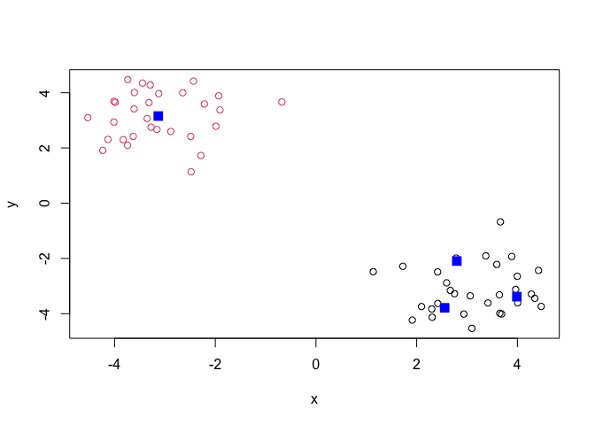

Hierarchal clustering: lets take our same data ‘z’ and see how hclust()
works

First we need a distance matrix of our data to be clustered

``` r
d <- dist(z)
hc <- hclust(d)
hc
```


    Call:
    hclust(d = d)

    Cluster method   : complete 
    Distance         : euclidean 
    Number of objects: 60 

``` r
plot(hc)
abline(h=8, col="red")
```

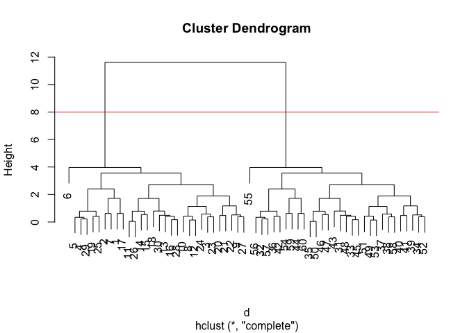

One branch side of the plot is all 1-30 while the other is 31-60

I can get my cluster membership vector by “cutting the tree” with the
‘cutree()’ function like so:

``` r
grps <- cutree(hc, h=8)
grps
```

     [1] 1 1 1 1 1 1 1 1 1 1 1 1 1 1 1 1 1 1 1 1 1 1 1 1 1 1 1 1 1 1 2 2 2 2 2 2 2 2
    [39] 2 2 2 2 2 2 2 2 2 2 2 2 2 2 2 2 2 2 2 2 2 2

Q. Can you plot ‘z’ colored by our hclust results:

``` r
plot(z, col=grps)
```

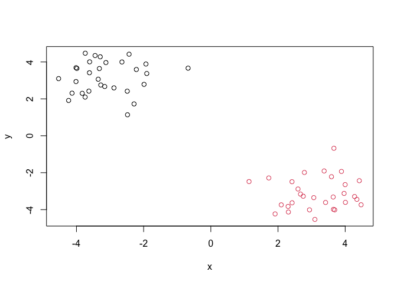

PCA: Principle Component Analysis

START OF LAB MATERIALS

Importing Data

``` r
url <- "https://tinyurl.com/UK-foods"
x <- read.csv(url, row.names=1)
head(x)
```

                   England Wales Scotland N.Ireland
    Cheese             105   103      103        66
    Carcass_meat       245   227      242       267
    Other_meat         685   803      750       586
    Fish               147   160      122        93
    Fats_and_oils      193   235      184       209
    Sugars             156   175      147       139

Q1. How many rows and columns are in your new data frame named x? What R
functions could you use to answer this questions?

``` r
dim(x)
```

    [1] 17  4

Using the Dim() function we found that there are 17 rows and 4 columns

Q2. Which approach to solving the ‘row-names problem’ mentioned above do
you prefer and why? Is one approach more robust than another under
certain circumstances?

I prefer the second method. The second method allows me to edit row
names in a much more direct, and in my opinion, clean fashion than the
first method which requires a whole new line of code.

``` r
barplot(as.matrix(x), beside=T, col=rainbow(nrow(x)))
```


Q3: Changing what optional argument in the above barplot() function
results in the following plot?

Changing the beside function to false will yield the plot as seen below.

``` r
barplot(as.matrix(x), beside=F, col=rainbow(nrow(x)))
```


Q5: Generating all pairwise plots may help somewhat. Can you make sense
of the following code and resulting figure? What does it mean if a given
point lies on the diagonal for a given plot?

The code pairs(x, col=rainbow(10), pch=16) generates pairwise scatter
plots for all combinations of variables in x, using a rainbow color
scheme and filled circle points. If a point lies on the diagonal in a
given plot, it indicates that the values for the two variables being
compared are equal at that point.

Class note: pairs plots can be useful for small sets of data but for
large sets of data its ridiculous to be expected to see trens using this
plot. PCA will help.

``` r
pairs(x, col=rainbow(10), pch=16)
```


Q6. What is the main differences between N. Ireland and the other
countries of the UK in terms of this data-set?

Northern Ireland consumes much more fresh potatos and less fresh fruit.

How does PCA capture this data?

``` r
pca <- prcomp (t(x))
summary(pca)
```

    Importance of components:
                                PC1      PC2      PC3       PC4
    Standard deviation     324.1502 212.7478 73.87622 2.921e-14
    Proportion of Variance   0.6744   0.2905  0.03503 0.000e+00
    Cumulative Proportion    0.6744   0.9650  1.00000 1.000e+00

``` r
pca$x
```

                     PC1         PC2        PC3           PC4
    England   -144.99315   -2.532999 105.768945 -9.152022e-15
    Wales     -240.52915 -224.646925 -56.475555  5.560040e-13
    Scotland   -91.86934  286.081786 -44.415495 -6.638419e-13
    N.Ireland  477.39164  -58.901862  -4.877895  1.329771e-13

Q7. Complete the code below to generate a plot of PC1 vs PC2. The second
line adds text labels over the data points.

The completed code is below

``` r
plot(pca$x[,1], pca$x[,2],
 
     xlab="PC1 (67.4%)", ylab="PC2 (29%)", xlim=c(-270,500))

#Q8. Customize your plot so that the colors of the country names match the colors in our UK and Ireland map and table at start of this document. 

text(pca$x[,1], pca$x[,2], colnames(x),col=c("red", "orange", "blue", "green"))
```

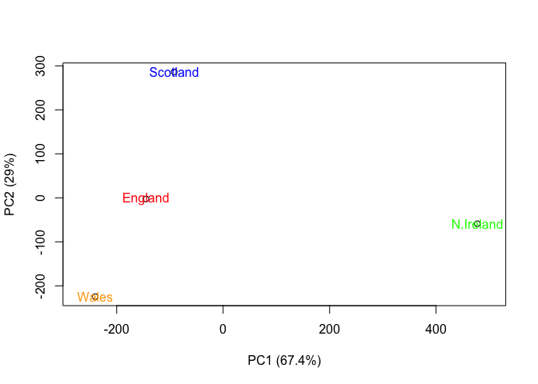

     col=c("red", "black", "blue", "green"), pch=16,
     

``` r
v <- round( pca$sdev^2/sum(pca$sdev^2) * 100 )
v
```

    [1] 67 29  4  0

``` r
z <- summary(pca)
z$importance
```

                                 PC1       PC2      PC3          PC4
    Standard deviation     324.15019 212.74780 73.87622 2.921348e-14
    Proportion of Variance   0.67444   0.29052  0.03503 0.000000e+00
    Cumulative Proportion    0.67444   0.96497  1.00000 1.000000e+00

``` r
barplot(v, xlab="Principal Component", ylab="Percent Variation")
```


``` r
par(mar=c(10, 3, 0.35, 0))
barplot( pca$rotation[,1], las=2 )
```


Q9: Generate a similar ‘loadings plot’ for PC2. What two food groups
feature prominantely and what does PC2 maninly tell us about?

The two food groups that feature prominently are Fresh Potatoes and Soft
Drinks. PC2 mainly tells us about the second greatest amount of
variation between the countries.

``` r
par(mar=c(10, 3, 0.35, 0))
barplot( pca$rotation[,2], las=2 )
```


