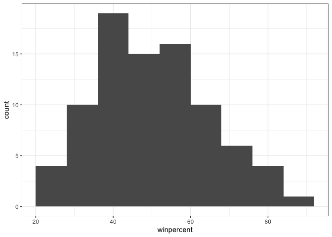
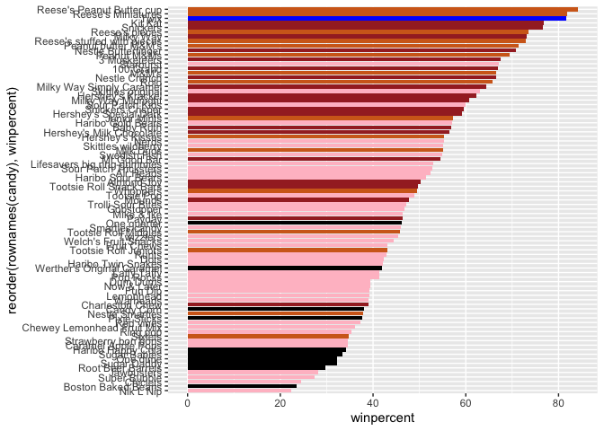
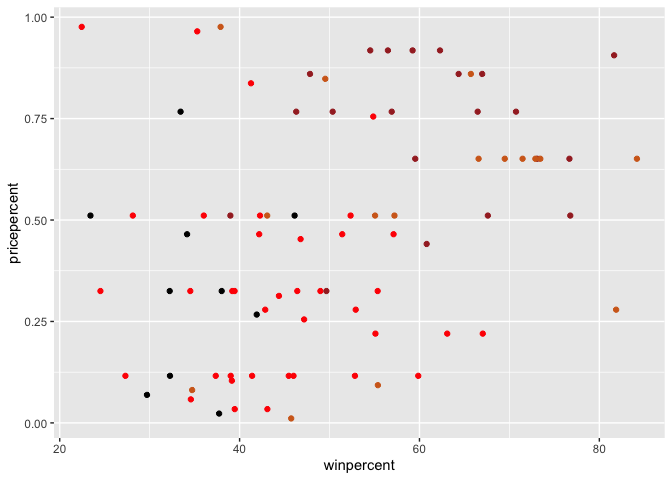
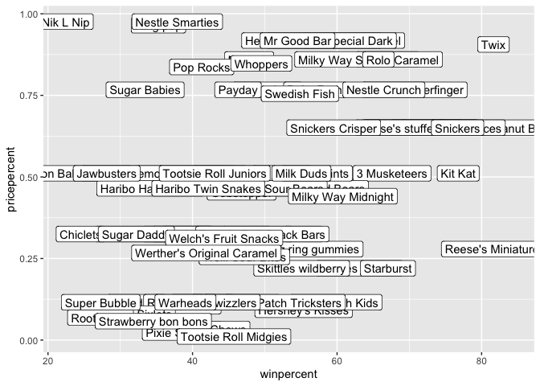
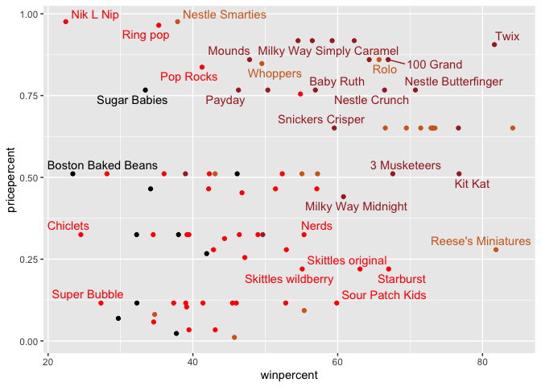
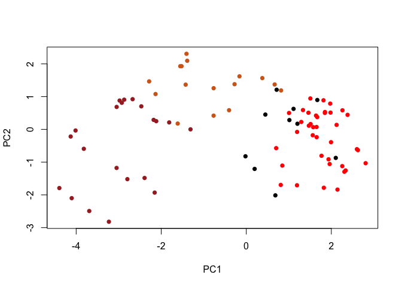
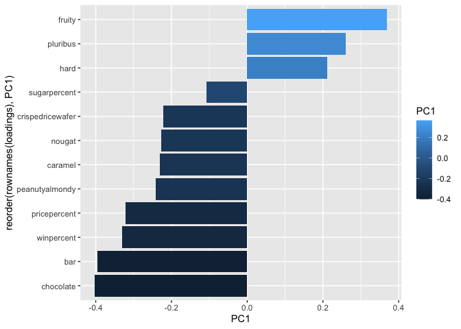
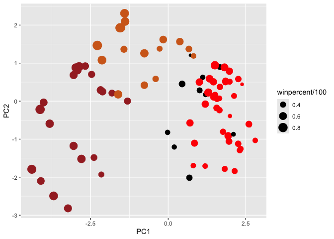

# Class10 - Halloween Mini Project
Adam Bisharat

``` r
candy_file <- "candy-data.csv"
candy <- read.csv(candy_file, row.names = 1)
head(candy)
```

                 chocolate fruity caramel peanutyalmondy nougat crispedricewafer
    100 Grand            1      0       1              0      0                1
    3 Musketeers         1      0       0              0      1                0
    One dime             0      0       0              0      0                0
    One quarter          0      0       0              0      0                0
    Air Heads            0      1       0              0      0                0
    Almond Joy           1      0       0              1      0                0
                 hard bar pluribus sugarpercent pricepercent winpercent
    100 Grand       0   1        0        0.732        0.860   66.97173
    3 Musketeers    0   1        0        0.604        0.511   67.60294
    One dime        0   0        0        0.011        0.116   32.26109
    One quarter     0   0        0        0.011        0.511   46.11650
    Air Heads       0   0        0        0.906        0.511   52.34146
    Almond Joy      0   1        0        0.465        0.767   50.34755

> Q1. How many different candy types are in this dataset?

``` r
nrow(candy)
```

    [1] 85

85 candy types in this data set

> Q2. How many fruity candy types are in the dataset?

``` r
sum(candy$fruity)
```

    [1] 38

There are 38 fruity candies in the dataset.

> Q3. What is your favorite candy in the dataset and what is it’s
> winpercent value?

``` r
candy["Kit Kat",]$winpercent
```

    [1] 76.7686

My favorite candy is Kit Kat and its winpercent value is 76.7686

> Q4. What is the winpercent value for “Kit Kat”?

``` r
candy["Kit Kat",]$winpercent
```

    [1] 76.7686

winpercent value is 76.7686 (That was not planned kit kats are actually
my favorite)

> Q5. What is the winpercent value for “Tootsie Roll Snack Bars”?

``` r
candy["Tootsie Roll Snack Bars",]$winpercent
```

    [1] 49.6535

``` r
library(dplyr)
```


    Attaching package: 'dplyr'

    The following objects are masked from 'package:stats':

        filter, lag

    The following objects are masked from 'package:base':

        intersect, setdiff, setequal, union

``` r
candy |>
filter(rownames(candy)=="Haribo Happy Cola") |>
select(winpercent)
```

                      winpercent
    Haribo Happy Cola   34.15896

``` r
candy |>
filter(winpercent > 50) |>
filter(fruity==1)
```

                                chocolate fruity caramel peanutyalmondy nougat
    Air Heads                           0      1       0              0      0
    Haribo Gold Bears                   0      1       0              0      0
    Haribo Sour Bears                   0      1       0              0      0
    Lifesavers big ring gummies         0      1       0              0      0
    Nerds                               0      1       0              0      0
    Skittles original                   0      1       0              0      0
    Skittles wildberry                  0      1       0              0      0
    Sour Patch Kids                     0      1       0              0      0
    Sour Patch Tricksters               0      1       0              0      0
    Starburst                           0      1       0              0      0
    Swedish Fish                        0      1       0              0      0
                                crispedricewafer hard bar pluribus sugarpercent
    Air Heads                                  0    0   0        0        0.906
    Haribo Gold Bears                          0    0   0        1        0.465
    Haribo Sour Bears                          0    0   0        1        0.465
    Lifesavers big ring gummies                0    0   0        0        0.267
    Nerds                                      0    1   0        1        0.848
    Skittles original                          0    0   0        1        0.941
    Skittles wildberry                         0    0   0        1        0.941
    Sour Patch Kids                            0    0   0        1        0.069
    Sour Patch Tricksters                      0    0   0        1        0.069
    Starburst                                  0    0   0        1        0.151
    Swedish Fish                               0    0   0        1        0.604
                                pricepercent winpercent
    Air Heads                          0.511   52.34146
    Haribo Gold Bears                  0.465   57.11974
    Haribo Sour Bears                  0.465   51.41243
    Lifesavers big ring gummies        0.279   52.91139
    Nerds                              0.325   55.35405
    Skittles original                  0.220   63.08514
    Skittles wildberry                 0.220   55.10370
    Sour Patch Kids                    0.116   59.86400
    Sour Patch Tricksters              0.116   52.82595
    Starburst                          0.220   67.03763
    Swedish Fish                       0.755   54.86111

``` r
candy[candy$winpercent > 50,][candy$fruity==1,]
```

                                chocolate fruity caramel peanutyalmondy nougat
    Baby Ruth                           1      0       1              1      1
    Hershey's Milk Chocolate            1      0       0              0      0
    Junior Mints                        1      0       0              0      0
    Kit Kat                             1      0       0              0      0
    Lifesavers big ring gummies         0      1       0              0      0
    Peanut butter M&M's                 1      0       0              1      0
    M&M's                               1      0       0              0      0
    Milk Duds                           1      0       1              0      0
    Milky Way                           1      0       1              0      1
    Milky Way Midnight                  1      0       1              0      1
    Mr Good Bar                         1      0       0              1      0
    Nerds                               0      1       0              0      0
    Reese's Peanut Butter cup           1      0       0              1      0
    Rolo                                1      0       1              0      0
    Skittles original                   0      1       0              0      0
    Skittles wildberry                  0      1       0              0      0
    Sour Patch Kids                     0      1       0              0      0
    NA                                 NA     NA      NA             NA     NA
    NA.1                               NA     NA      NA             NA     NA
    NA.2                               NA     NA      NA             NA     NA
    NA.3                               NA     NA      NA             NA     NA
    NA.4                               NA     NA      NA             NA     NA
    NA.5                               NA     NA      NA             NA     NA
    NA.6                               NA     NA      NA             NA     NA
    NA.7                               NA     NA      NA             NA     NA
    NA.8                               NA     NA      NA             NA     NA
    NA.9                               NA     NA      NA             NA     NA
    NA.10                              NA     NA      NA             NA     NA
    NA.11                              NA     NA      NA             NA     NA
    NA.12                              NA     NA      NA             NA     NA
    NA.13                              NA     NA      NA             NA     NA
    NA.14                              NA     NA      NA             NA     NA
    NA.15                              NA     NA      NA             NA     NA
    NA.16                              NA     NA      NA             NA     NA
    NA.17                              NA     NA      NA             NA     NA
    NA.18                              NA     NA      NA             NA     NA
    NA.19                              NA     NA      NA             NA     NA
    NA.20                              NA     NA      NA             NA     NA
                                crispedricewafer hard bar pluribus sugarpercent
    Baby Ruth                                  0    0   1        0        0.604
    Hershey's Milk Chocolate                   0    0   1        0        0.430
    Junior Mints                               0    0   0        1        0.197
    Kit Kat                                    1    0   1        0        0.313
    Lifesavers big ring gummies                0    0   0        0        0.267
    Peanut butter M&M's                        0    0   0        1        0.825
    M&M's                                      0    0   0        1        0.825
    Milk Duds                                  0    0   0        1        0.302
    Milky Way                                  0    0   1        0        0.604
    Milky Way Midnight                         0    0   1        0        0.732
    Mr Good Bar                                0    0   1        0        0.313
    Nerds                                      0    1   0        1        0.848
    Reese's Peanut Butter cup                  0    0   0        0        0.720
    Rolo                                       0    0   0        1        0.860
    Skittles original                          0    0   0        1        0.941
    Skittles wildberry                         0    0   0        1        0.941
    Sour Patch Kids                            0    0   0        1        0.069
    NA                                        NA   NA  NA       NA           NA
    NA.1                                      NA   NA  NA       NA           NA
    NA.2                                      NA   NA  NA       NA           NA
    NA.3                                      NA   NA  NA       NA           NA
    NA.4                                      NA   NA  NA       NA           NA
    NA.5                                      NA   NA  NA       NA           NA
    NA.6                                      NA   NA  NA       NA           NA
    NA.7                                      NA   NA  NA       NA           NA
    NA.8                                      NA   NA  NA       NA           NA
    NA.9                                      NA   NA  NA       NA           NA
    NA.10                                     NA   NA  NA       NA           NA
    NA.11                                     NA   NA  NA       NA           NA
    NA.12                                     NA   NA  NA       NA           NA
    NA.13                                     NA   NA  NA       NA           NA
    NA.14                                     NA   NA  NA       NA           NA
    NA.15                                     NA   NA  NA       NA           NA
    NA.16                                     NA   NA  NA       NA           NA
    NA.17                                     NA   NA  NA       NA           NA
    NA.18                                     NA   NA  NA       NA           NA
    NA.19                                     NA   NA  NA       NA           NA
    NA.20                                     NA   NA  NA       NA           NA
                                pricepercent winpercent
    Baby Ruth                          0.767   56.91455
    Hershey's Milk Chocolate           0.918   56.49050
    Junior Mints                       0.511   57.21925
    Kit Kat                            0.511   76.76860
    Lifesavers big ring gummies        0.279   52.91139
    Peanut butter M&M's                0.651   71.46505
    M&M's                              0.651   66.57458
    Milk Duds                          0.511   55.06407
    Milky Way                          0.651   73.09956
    Milky Way Midnight                 0.441   60.80070
    Mr Good Bar                        0.918   54.52645
    Nerds                              0.325   55.35405
    Reese's Peanut Butter cup          0.651   84.18029
    Rolo                               0.860   65.71629
    Skittles original                  0.220   63.08514
    Skittles wildberry                 0.220   55.10370
    Sour Patch Kids                    0.116   59.86400
    NA                                    NA         NA
    NA.1                                  NA         NA
    NA.2                                  NA         NA
    NA.3                                  NA         NA
    NA.4                                  NA         NA
    NA.5                                  NA         NA
    NA.6                                  NA         NA
    NA.7                                  NA         NA
    NA.8                                  NA         NA
    NA.9                                  NA         NA
    NA.10                                 NA         NA
    NA.11                                 NA         NA
    NA.12                                 NA         NA
    NA.13                                 NA         NA
    NA.14                                 NA         NA
    NA.15                                 NA         NA
    NA.16                                 NA         NA
    NA.17                                 NA         NA
    NA.18                                 NA         NA
    NA.19                                 NA         NA
    NA.20                                 NA         NA

To get a quick insight into a new dataset some folks like using the
skimer package and its skim() function.

``` r
library("skimr")
skim(candy)
```

|                                                  |       |
|:-------------------------------------------------|:------|
| Name                                             | candy |
| Number of rows                                   | 85    |
| Number of columns                                | 12    |
| \_\_\_\_\_\_\_\_\_\_\_\_\_\_\_\_\_\_\_\_\_\_\_   |       |
| Column type frequency:                           |       |
| numeric                                          | 12    |
| \_\_\_\_\_\_\_\_\_\_\_\_\_\_\_\_\_\_\_\_\_\_\_\_ |       |
| Group variables                                  | None  |

Data summary

**Variable type: numeric**

| skim_variable | n_missing | complete_rate | mean | sd | p0 | p25 | p50 | p75 | p100 | hist |
|:---|---:|---:|---:|---:|---:|---:|---:|---:|---:|:---|
| chocolate | 0 | 1 | 0.44 | 0.50 | 0.00 | 0.00 | 0.00 | 1.00 | 1.00 | ▇▁▁▁▆ |
| fruity | 0 | 1 | 0.45 | 0.50 | 0.00 | 0.00 | 0.00 | 1.00 | 1.00 | ▇▁▁▁▆ |
| caramel | 0 | 1 | 0.16 | 0.37 | 0.00 | 0.00 | 0.00 | 0.00 | 1.00 | ▇▁▁▁▂ |
| peanutyalmondy | 0 | 1 | 0.16 | 0.37 | 0.00 | 0.00 | 0.00 | 0.00 | 1.00 | ▇▁▁▁▂ |
| nougat | 0 | 1 | 0.08 | 0.28 | 0.00 | 0.00 | 0.00 | 0.00 | 1.00 | ▇▁▁▁▁ |
| crispedricewafer | 0 | 1 | 0.08 | 0.28 | 0.00 | 0.00 | 0.00 | 0.00 | 1.00 | ▇▁▁▁▁ |
| hard | 0 | 1 | 0.18 | 0.38 | 0.00 | 0.00 | 0.00 | 0.00 | 1.00 | ▇▁▁▁▂ |
| bar | 0 | 1 | 0.25 | 0.43 | 0.00 | 0.00 | 0.00 | 0.00 | 1.00 | ▇▁▁▁▂ |
| pluribus | 0 | 1 | 0.52 | 0.50 | 0.00 | 0.00 | 1.00 | 1.00 | 1.00 | ▇▁▁▁▇ |
| sugarpercent | 0 | 1 | 0.48 | 0.28 | 0.01 | 0.22 | 0.47 | 0.73 | 0.99 | ▇▇▇▇▆ |
| pricepercent | 0 | 1 | 0.47 | 0.29 | 0.01 | 0.26 | 0.47 | 0.65 | 0.98 | ▇▇▇▇▆ |
| winpercent | 0 | 1 | 50.32 | 14.71 | 22.45 | 39.14 | 47.83 | 59.86 | 84.18 | ▃▇▆▅▂ |

``` r
skimr::skim(candy)
```

|                                                  |       |
|:-------------------------------------------------|:------|
| Name                                             | candy |
| Number of rows                                   | 85    |
| Number of columns                                | 12    |
| \_\_\_\_\_\_\_\_\_\_\_\_\_\_\_\_\_\_\_\_\_\_\_   |       |
| Column type frequency:                           |       |
| numeric                                          | 12    |
| \_\_\_\_\_\_\_\_\_\_\_\_\_\_\_\_\_\_\_\_\_\_\_\_ |       |
| Group variables                                  | None  |

Data summary

**Variable type: numeric**

| skim_variable | n_missing | complete_rate | mean | sd | p0 | p25 | p50 | p75 | p100 | hist |
|:---|---:|---:|---:|---:|---:|---:|---:|---:|---:|:---|
| chocolate | 0 | 1 | 0.44 | 0.50 | 0.00 | 0.00 | 0.00 | 1.00 | 1.00 | ▇▁▁▁▆ |
| fruity | 0 | 1 | 0.45 | 0.50 | 0.00 | 0.00 | 0.00 | 1.00 | 1.00 | ▇▁▁▁▆ |
| caramel | 0 | 1 | 0.16 | 0.37 | 0.00 | 0.00 | 0.00 | 0.00 | 1.00 | ▇▁▁▁▂ |
| peanutyalmondy | 0 | 1 | 0.16 | 0.37 | 0.00 | 0.00 | 0.00 | 0.00 | 1.00 | ▇▁▁▁▂ |
| nougat | 0 | 1 | 0.08 | 0.28 | 0.00 | 0.00 | 0.00 | 0.00 | 1.00 | ▇▁▁▁▁ |
| crispedricewafer | 0 | 1 | 0.08 | 0.28 | 0.00 | 0.00 | 0.00 | 0.00 | 1.00 | ▇▁▁▁▁ |
| hard | 0 | 1 | 0.18 | 0.38 | 0.00 | 0.00 | 0.00 | 0.00 | 1.00 | ▇▁▁▁▂ |
| bar | 0 | 1 | 0.25 | 0.43 | 0.00 | 0.00 | 0.00 | 0.00 | 1.00 | ▇▁▁▁▂ |
| pluribus | 0 | 1 | 0.52 | 0.50 | 0.00 | 0.00 | 1.00 | 1.00 | 1.00 | ▇▁▁▁▇ |
| sugarpercent | 0 | 1 | 0.48 | 0.28 | 0.01 | 0.22 | 0.47 | 0.73 | 0.99 | ▇▇▇▇▆ |
| pricepercent | 0 | 1 | 0.47 | 0.29 | 0.01 | 0.26 | 0.47 | 0.65 | 0.98 | ▇▇▇▇▆ |
| winpercent | 0 | 1 | 50.32 | 14.71 | 22.45 | 39.14 | 47.83 | 59.86 | 84.18 | ▃▇▆▅▂ |

> Q6. Is there any variable/column that looks to be on a different scale
> to the majority of the other columns in the dataset?

Yes, winpercent

> Q7. What do you think a zero and one represent for the
> candy\$chocolate column?

No chocolate in that column.

> Q8. Plot a histogram of winpercent values

This can be done using the “base” in R hist() function or ggplot()

``` r
hist(candy$winpercent, breaks=30)
```


``` r
library(ggplot2)
ggplot(candy) +
aes(winpercent) +
geom_histogram(binwidth=8) +
theme_bw()
```



> Q9. Is the distribution of winpercent values symmetrical?

No, the distribution is not perfectly symmetrical.

> Q10. Is the center of the distribution above or below 50%?

``` r
summary(candy$winpercent)
```

       Min. 1st Qu.  Median    Mean 3rd Qu.    Max. 
      22.45   39.14   47.83   50.32   59.86   84.18 

The median is below 50% (47.8%) so the center of distribution is below
50%.

> Q11. On average is chocolate candy higher or lower ranked than fruit
> candy?

On average chocolate candy is higher ranked than fruit candy.

``` r
fruit.candy <- candy |>
filter(fruity==1)
summary(fruit.candy$winpercent)
```

       Min. 1st Qu.  Median    Mean 3rd Qu.    Max. 
      22.45   39.04   42.97   44.12   52.11   67.04 

``` r
choc.candy <- candy |>
filter(chocolate==1)
summary(choc.candy$winpercent)
```

       Min. 1st Qu.  Median    Mean 3rd Qu.    Max. 
      34.72   50.35   60.80   60.92   70.74   84.18 

``` r
summary(candy[as.logical(candy$chocolate),]$winpercent)
```

       Min. 1st Qu.  Median    Mean 3rd Qu.    Max. 
      34.72   50.35   60.80   60.92   70.74   84.18 

``` r
t.test(choc.candy$winpercent, fruit.candy$winpercent)
```


        Welch Two Sample t-test

    data:  choc.candy$winpercent and fruit.candy$winpercent
    t = 6.2582, df = 68.882, p-value = 2.871e-08
    alternative hypothesis: true difference in means is not equal to 0
    95 percent confidence interval:
     11.44563 22.15795
    sample estimates:
    mean of x mean of y 
     60.92153  44.11974 

P-Value \< 0.05 (p-value = 2.871e-08) so it is statistically
signifigant.

> Q13. What are the five least liked candy types in this set?

The 5 least liked candies include Nik L Nip, Boston Baked Beans,
Chiclets, Super Bubble, and Jawbusters.

``` r
play <- c("d", "a", "c")
sort(play)
```

    [1] "a" "c" "d"

``` r
order(play)
```

    [1] 2 3 1

``` r
play[order(play)]
```

    [1] "a" "c" "d"

``` r
head(candy[order(candy$winpercent), ], 5)
```

                       chocolate fruity caramel peanutyalmondy nougat
    Nik L Nip                  0      1       0              0      0
    Boston Baked Beans         0      0       0              1      0
    Chiclets                   0      1       0              0      0
    Super Bubble               0      1       0              0      0
    Jawbusters                 0      1       0              0      0
                       crispedricewafer hard bar pluribus sugarpercent pricepercent
    Nik L Nip                         0    0   0        1        0.197        0.976
    Boston Baked Beans                0    0   0        1        0.313        0.511
    Chiclets                          0    0   0        1        0.046        0.325
    Super Bubble                      0    0   0        0        0.162        0.116
    Jawbusters                        0    1   0        1        0.093        0.511
                       winpercent
    Nik L Nip            22.44534
    Boston Baked Beans   23.41782
    Chiclets             24.52499
    Super Bubble         27.30386
    Jawbusters           28.12744

> Q14. What are the top 5 all time favorite candy types out of this set?

The top 5 candies are Snickers, Kit Kat, Twix, Reese’s Miniatures, and
Reese’s Peanut Butter cups.

``` r
tail(candy[order(candy$winpercent), ], 5)
```

                              chocolate fruity caramel peanutyalmondy nougat
    Snickers                          1      0       1              1      1
    Kit Kat                           1      0       0              0      0
    Twix                              1      0       1              0      0
    Reese's Miniatures                1      0       0              1      0
    Reese's Peanut Butter cup         1      0       0              1      0
                              crispedricewafer hard bar pluribus sugarpercent
    Snickers                                 0    0   1        0        0.546
    Kit Kat                                  1    0   1        0        0.313
    Twix                                     1    0   1        0        0.546
    Reese's Miniatures                       0    0   0        0        0.034
    Reese's Peanut Butter cup                0    0   0        0        0.720
                              pricepercent winpercent
    Snickers                         0.651   76.67378
    Kit Kat                          0.511   76.76860
    Twix                             0.906   81.64291
    Reese's Miniatures               0.279   81.86626
    Reese's Peanut Butter cup        0.651   84.18029

> Q15. Make a first barplot of candy ranking based on winpercent values.

``` r
library(ggplot2)
ggplot(candy) +
aes(winpercent, rownames(candy)) +
geom_col()
```


> Q16. This is quite ugly, use the reorder() function to get the bars
> sorted by winpercent?

``` r
library(ggplot2)
ggplot(candy) +
aes(winpercent, reorder(rownames(candy),winpercent)) +
geom_col()
```


``` r
ggplot(candy) +
aes(x=winpercent, y=reorder(rownames(candy),winpercent),
fill=chocolate) +
geom_col()
```


``` r
mycols <- rep("black", nrow(candy))
mycols[as.logical(candy$chocolate)] <- "chocolate"
mycols[as.logical(candy$bar)] <- "brown"
mycols[as.logical(candy$fruity)] = "pink"
mycols
```

     [1] "brown"     "brown"     "black"     "black"     "pink"      "brown"    
     [7] "brown"     "black"     "black"     "pink"      "brown"     "pink"     
    [13] "pink"      "pink"      "pink"      "pink"      "pink"      "pink"     
    [19] "pink"      "black"     "pink"      "pink"      "chocolate" "brown"    
    [25] "brown"     "brown"     "pink"      "chocolate" "brown"     "pink"     
    [31] "pink"      "pink"      "chocolate" "chocolate" "pink"      "chocolate"
    [37] "brown"     "brown"     "brown"     "brown"     "brown"     "pink"     
    [43] "brown"     "brown"     "pink"      "pink"      "brown"     "chocolate"
    [49] "black"     "pink"      "pink"      "chocolate" "chocolate" "chocolate"
    [55] "chocolate" "pink"      "chocolate" "black"     "pink"      "chocolate"
    [61] "pink"      "pink"      "chocolate" "pink"      "brown"     "brown"    
    [67] "pink"      "pink"      "pink"      "pink"      "black"     "black"    
    [73] "pink"      "pink"      "pink"      "chocolate" "chocolate" "brown"    
    [79] "pink"      "brown"     "pink"      "pink"      "pink"      "black"    
    [85] "chocolate"

``` r
mycols[rownames(candy)=="Twix"] <- "blue"
ggplot(candy) +
aes(x=winpercent, y=reorder(rownames(candy),winpercent),
fill=chocolate) +
geom_col(fill=mycols)
```



> Q17. What is the worst ranked chocolate candy?

The worst ranked chocolate candy is Sixlets.

> Q18. What is the best ranked fruity candy?

The best ranked fruity candy is Starburst.

``` r
mycols <- rep("black", nrow(candy))
mycols[rownames(candy)=="Twix"] <- "blue"
mycols[as.logical(candy$chocolate)] <- "chocolate"
mycols[as.logical(candy$bar)] <- "brown"
mycols[as.logical(candy$fruity)] = "pink"
mycols[as.logical(candy$fruity)] <- "red"
ggplot(candy) +
aes(winpercent, pricepercent) +
geom_point(col=mycols)
```



``` r
ggplot(candy) +
aes(winpercent, pricepercent, label=rownames(candy)) +
geom_point(col=mycols) +
geom_label()
```



``` r
library(ggrepel)
ggplot(candy) +
aes(winpercent, pricepercent, label=rownames(candy)) +
geom_point(col=mycols) +
geom_text_repel(col=mycols, max.overlaps = 5)
```

    Warning: ggrepel: 57 unlabeled data points (too many overlaps). Consider
    increasing max.overlaps



> Q19. Which candy type is the highest ranked in terms of winpercent for
> the least money - i.e. offers the most bang for your buck?

Reece’s miniatures

``` r
ord <- order(candy$pricepercent, decreasing = TRUE)
head( candy[ord,c(11,12)], n=5 )
```

                             pricepercent winpercent
    Nik L Nip                       0.976   22.44534
    Nestle Smarties                 0.976   37.88719
    Ring pop                        0.965   35.29076
    Hershey's Krackel               0.918   62.28448
    Hershey's Milk Chocolate        0.918   56.49050

> Q20. What are the top 5 most expensive candy types in the dataset and
> of these which is the least popular?

The 5 most expensive candies in the dataset are: Nik L Nip, Nestle
Smarties, Ring pop, Hershey’s Krackel, and Hershey’s Milk Chocolate. The
least popular is Nip L Nip.

``` r
library(corrplot)
```

    corrplot 0.95 loaded

``` r
cij <- cor(candy)
cij
```

                      chocolate      fruity     caramel peanutyalmondy      nougat
    chocolate         1.0000000 -0.74172106  0.24987535     0.37782357  0.25489183
    fruity           -0.7417211  1.00000000 -0.33548538    -0.39928014 -0.26936712
    caramel           0.2498753 -0.33548538  1.00000000     0.05935614  0.32849280
    peanutyalmondy    0.3778236 -0.39928014  0.05935614     1.00000000  0.21311310
    nougat            0.2548918 -0.26936712  0.32849280     0.21311310  1.00000000
    crispedricewafer  0.3412098 -0.26936712  0.21311310    -0.01764631 -0.08974359
    hard             -0.3441769  0.39067750 -0.12235513    -0.20555661 -0.13867505
    bar               0.5974211 -0.51506558  0.33396002     0.26041960  0.52297636
    pluribus         -0.3396752  0.29972522 -0.26958501    -0.20610932 -0.31033884
    sugarpercent      0.1041691 -0.03439296  0.22193335     0.08788927  0.12308135
    pricepercent      0.5046754 -0.43096853  0.25432709     0.30915323  0.15319643
    winpercent        0.6365167 -0.38093814  0.21341630     0.40619220  0.19937530
                     crispedricewafer        hard         bar    pluribus
    chocolate              0.34120978 -0.34417691  0.59742114 -0.33967519
    fruity                -0.26936712  0.39067750 -0.51506558  0.29972522
    caramel                0.21311310 -0.12235513  0.33396002 -0.26958501
    peanutyalmondy        -0.01764631 -0.20555661  0.26041960 -0.20610932
    nougat                -0.08974359 -0.13867505  0.52297636 -0.31033884
    crispedricewafer       1.00000000 -0.13867505  0.42375093 -0.22469338
    hard                  -0.13867505  1.00000000 -0.26516504  0.01453172
    bar                    0.42375093 -0.26516504  1.00000000 -0.59340892
    pluribus              -0.22469338  0.01453172 -0.59340892  1.00000000
    sugarpercent           0.06994969  0.09180975  0.09998516  0.04552282
    pricepercent           0.32826539 -0.24436534  0.51840654 -0.22079363
    winpercent             0.32467965 -0.31038158  0.42992933 -0.24744787
                     sugarpercent pricepercent winpercent
    chocolate          0.10416906    0.5046754  0.6365167
    fruity            -0.03439296   -0.4309685 -0.3809381
    caramel            0.22193335    0.2543271  0.2134163
    peanutyalmondy     0.08788927    0.3091532  0.4061922
    nougat             0.12308135    0.1531964  0.1993753
    crispedricewafer   0.06994969    0.3282654  0.3246797
    hard               0.09180975   -0.2443653 -0.3103816
    bar                0.09998516    0.5184065  0.4299293
    pluribus           0.04552282   -0.2207936 -0.2474479
    sugarpercent       1.00000000    0.3297064  0.2291507
    pricepercent       0.32970639    1.0000000  0.3453254
    winpercent         0.22915066    0.3453254  1.0000000

``` r
corrplot(cij)
```


> Q22. Examining this plot what two variables are anti-correlated
> (i.e. have minus values)?

Fruit and chocolate are anti-correlated.

> Q23. Similarly, what two variables are most positively correlated?

The two most positively correlated are chocolate and winpercent.

``` r
pca <- prcomp(candy, scale=T)
summary(pca)
```

    Importance of components:
                              PC1    PC2    PC3     PC4    PC5     PC6     PC7
    Standard deviation     2.0788 1.1378 1.1092 1.07533 0.9518 0.81923 0.81530
    Proportion of Variance 0.3601 0.1079 0.1025 0.09636 0.0755 0.05593 0.05539
    Cumulative Proportion  0.3601 0.4680 0.5705 0.66688 0.7424 0.79830 0.85369
                               PC8     PC9    PC10    PC11    PC12
    Standard deviation     0.74530 0.67824 0.62349 0.43974 0.39760
    Proportion of Variance 0.04629 0.03833 0.03239 0.01611 0.01317
    Cumulative Proportion  0.89998 0.93832 0.97071 0.98683 1.00000

``` r
PCA <- plot(pca$x[,1:2], col=mycols, pch=16)
```



``` r
pca$rotation
```

                            PC1         PC2         PC3          PC4          PC5
    chocolate        -0.4019466  0.21404160  0.01601358 -0.016673032  0.066035846
    fruity            0.3683883 -0.18304666 -0.13765612 -0.004479829  0.143535325
    caramel          -0.2299709 -0.40349894 -0.13294166 -0.024889542 -0.507301501
    peanutyalmondy   -0.2407155  0.22446919  0.18272802  0.466784287  0.399930245
    nougat           -0.2268102 -0.47016599  0.33970244  0.299581403 -0.188852418
    crispedricewafer -0.2215182  0.09719527 -0.36485542 -0.605594730  0.034652316
    hard              0.2111587 -0.43262603 -0.20295368 -0.032249660  0.574557816
    bar              -0.3947433 -0.22255618  0.10696092 -0.186914549  0.077794806
    pluribus          0.2600041  0.36920922 -0.26813772  0.287246604 -0.392796479
    sugarpercent     -0.1083088 -0.23647379 -0.65509692  0.433896248  0.007469103
    pricepercent     -0.3207361  0.05883628 -0.33048843  0.063557149  0.043358887
    winpercent       -0.3298035  0.21115347 -0.13531766  0.117930997  0.168755073
                             PC6         PC7         PC8          PC9         PC10
    chocolate        -0.09018950 -0.08360642 -0.49084856 -0.151651568  0.107661356
    fruity           -0.04266105  0.46147889  0.39805802 -0.001248306  0.362062502
    caramel          -0.40346502 -0.44274741  0.26963447  0.019186442  0.229799010
    peanutyalmondy   -0.09416259 -0.25710489  0.45771445  0.381068550 -0.145912362
    nougat            0.09012643  0.36663902 -0.18793955  0.385278987  0.011323453
    crispedricewafer -0.09007640  0.13077042  0.13567736  0.511634999 -0.264810144
    hard             -0.12767365 -0.31933477 -0.38881683  0.258154433  0.220779142
    bar               0.25307332  0.24192992 -0.02982691  0.091872886 -0.003232321
    pluribus          0.03184932  0.04066352 -0.28652547  0.529954405  0.199303452
    sugarpercent      0.02737834  0.14721840 -0.04114076 -0.217685759 -0.488103337
    pricepercent      0.62908570 -0.14308215  0.16722078 -0.048991557  0.507716043
    winpercent       -0.56947283  0.40260385 -0.02936405 -0.124440117  0.358431235
                            PC11        PC12
    chocolate         0.10045278  0.69784924
    fruity            0.17494902  0.50624242
    caramel           0.13515820  0.07548984
    peanutyalmondy    0.11244275  0.12972756
    nougat           -0.38954473  0.09223698
    crispedricewafer -0.22615618  0.11727369
    hard              0.01342330 -0.10430092
    bar               0.74956878 -0.22010569
    pluribus          0.27971527 -0.06169246
    sugarpercent      0.05373286  0.04733985
    pricepercent     -0.26396582 -0.06698291
    winpercent       -0.11251626 -0.37693153

``` r
loadings <-as.data.frame(pca$rotation)
ggplot(loadings) +
aes(PC1, reorder(rownames(loadings), PC1), fill=PC1) +
geom_col()
```



``` r
my_data <- cbind(candy, pca$x[,1:3])
p <- ggplot(my_data) +
aes(x=PC1, y=PC2,
size=winpercent/100,
text=rownames(my_data),
label=rownames(my_data)) +
geom_point(col=mycols)
p
```



``` r
par(mar=c(8,4,2,2))
barplot(pca$rotation[,1], las=2, ylab="PC1 Contribution")
```


> Q24. What original variables are picked up strongly by PC1 in the
> positive direction? Do these make sense to you?

Fruity, pluribus, and hard are picked up strongly by PC1. This makes
sense since the most popular candies are fruity and chocolate candies in
bags and boxes.
