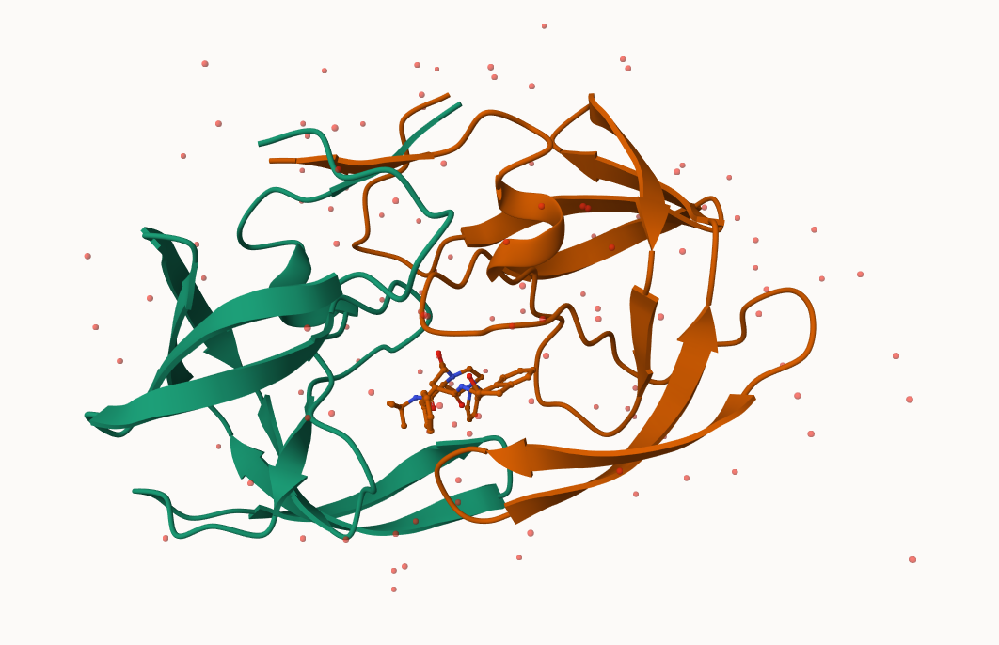
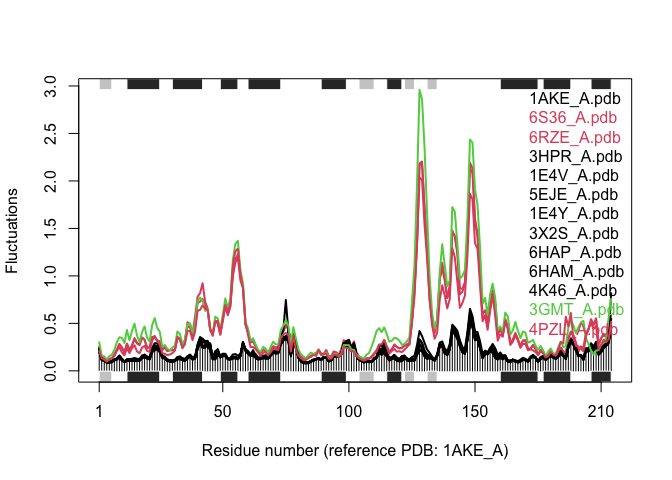

# Lab09: Structural Bioinformatics pt. 1
Adam Bisharat

The main database for structural data is called the PDB (protein Data
Bank). Let’s see what it contains:

``` r
PDB <- read.csv("ProteinData.csv" , row.names = 1)

PDB
```

                              X.ray     EM    NMR Multiple.methods Neutron Other
    Protein (only)          167,192 15,572 12,529              208      77    32
    Protein/Oligosaccharide   9,639  2,635     34                8       2     0
    Protein/NA                8,730  4,697    286                7       0     0
    Nucleic acid (only)       2,869    137  1,507               14       3     1
    Other                       170     10     33                0       0     0
    Oligosaccharide (only)       11      0      6                1       0     4
                              Total
    Protein (only)          195,610
    Protein/Oligosaccharide  12,318
    Protein/NA               13,720
    Nucleic acid (only)       4,531
    Other                       213
    Oligosaccharide (only)       22

``` r
PDB$Total
```

    [1] "195,610" "12,318"  "13,720"  "4,531"   "213"     "22"     

``` r
as.numeric(sub(",", "", PDB$Total))
```

    [1] 195610  12318  13720   4531    213     22

I could turn this into a function to fix the whole table or any future
table I read like this:

``` r
x <- PDB$Total
as.numeric(sub(",", "", x))
```

    [1] 195610  12318  13720   4531    213     22

``` r
comma2numeric <- function(x) {
  as.numeric(sub(",", "", x))
}
```

``` r
comma2numeric(PDB$X.ray)
```

    [1] 167192   9639   8730   2869    170     11

``` r
apply(PDB, 2, comma2numeric)
```

          X.ray    EM   NMR Multiple.methods Neutron Other  Total
    [1,] 167192 15572 12529              208      77    32 195610
    [2,]   9639  2635    34                8       2     0  12318
    [3,]   8730  4697   286                7       0     0  13720
    [4,]   2869   137  1507               14       3     1   4531
    [5,]    170    10    33                0       0     0    213
    [6,]     11     0     6                1       0     4     22

\##Or try a differnt read/import funciton:

``` r
library(readr)
PDBN <- read_csv("ProteinData.csv")
```

    Rows: 6 Columns: 8
    ── Column specification ────────────────────────────────────────────────────────
    Delimiter: ","
    chr (1): Molecular Type
    dbl (3): Multiple methods, Neutron, Other
    num (4): X-ray, EM, NMR, Total

    ℹ Use `spec()` to retrieve the full column specification for this data.
    ℹ Specify the column types or set `show_col_types = FALSE` to quiet this message.

``` r
PDBN$Total
```

    [1] 195610  12318  13720   4531    213     22

``` r
sum(PDBN$Total)
```

    [1] 226414

> Q1: What percentage of structures in the PDB are solved by X-Ray and
> Electron Microscopy.

``` r
Combined.Percent <- ((sum(PDBN$'X-ray') + sum(PDBN$'EM') ) / sum(PDBN$Total) ) * 100

XRay.Percent <- (sum(PDBN$'X-ray') / sum(PDBN$Total) ) * 100

EM.Percent <- sum(PDBN$'EM') / sum(PDBN$Total)  * 100


Combined.Percent 
```

    [1] 93.4845

``` r
XRay.Percent
```

    [1] 83.30359

``` r
EM.Percent 
```

    [1] 10.18091

``` r
PDBN
```

    # A tibble: 6 × 8
      `Molecular Type`   `X-ray`    EM   NMR `Multiple methods` Neutron Other  Total
      <chr>                <dbl> <dbl> <dbl>              <dbl>   <dbl> <dbl>  <dbl>
    1 Protein (only)      167192 15572 12529                208      77    32 195610
    2 Protein/Oligosacc…    9639  2635    34                  8       2     0  12318
    3 Protein/NA            8730  4697   286                  7       0     0  13720
    4 Nucleic acid (onl…    2869   137  1507                 14       3     1   4531
    5 Other                  170    10    33                  0       0     0    213
    6 Oligosaccharide (…      11     0     6                  1       0     4     22

> Q2: What proportion of structures in the PDB are protein?

``` r
PDBN$Total[1] / sum(PDBN$'Total')
```

    [1] 0.8639483

Molstar Viewer: 1HSG



.png)

.png)

.png)

> Q3: Type HIV in the PDB website search box on the home page and
> determine how many HIV-1 protease structures are in the current PDB?

226114

Bio3D Package very useful

``` r
library(bio3d)

pdb <- read.pdb("1hsg")
```

      Note: Accessing on-line PDB file

``` r
pdb
```


     Call:  read.pdb(file = "1hsg")

       Total Models#: 1
         Total Atoms#: 1686,  XYZs#: 5058  Chains#: 2  (values: A B)

         Protein Atoms#: 1514  (residues/Calpha atoms#: 198)
         Nucleic acid Atoms#: 0  (residues/phosphate atoms#: 0)

         Non-protein/nucleic Atoms#: 172  (residues: 128)
         Non-protein/nucleic resid values: [ HOH (127), MK1 (1) ]

       Protein sequence:
          PQITLWQRPLVTIKIGGQLKEALLDTGADDTVLEEMSLPGRWKPKMIGGIGGFIKVRQYD
          QILIEICGHKAIGTVLVGPTPVNIIGRNLLTQIGCTLNFPQITLWQRPLVTIKIGGQLKE
          ALLDTGADDTVLEEMSLPGRWKPKMIGGIGGFIKVRQYDQILIEICGHKAIGTVLVGPTP
          VNIIGRNLLTQIGCTLNF

    + attr: atom, xyz, seqres, helix, sheet,
            calpha, remark, call

``` r
attributes(pdb)
```

    $names
    [1] "atom"   "xyz"    "seqres" "helix"  "sheet"  "calpha" "remark" "call"  

    $class
    [1] "pdb" "sse"

``` r
head(pdb$atom)
```

      type eleno elety  alt resid chain resno insert      x      y     z o     b
    1 ATOM     1     N <NA>   PRO     A     1   <NA> 29.361 39.686 5.862 1 38.10
    2 ATOM     2    CA <NA>   PRO     A     1   <NA> 30.307 38.663 5.319 1 40.62
    3 ATOM     3     C <NA>   PRO     A     1   <NA> 29.760 38.071 4.022 1 42.64
    4 ATOM     4     O <NA>   PRO     A     1   <NA> 28.600 38.302 3.676 1 43.40
    5 ATOM     5    CB <NA>   PRO     A     1   <NA> 30.508 37.541 6.342 1 37.87
    6 ATOM     6    CG <NA>   PRO     A     1   <NA> 29.296 37.591 7.162 1 38.40
      segid elesy charge
    1  <NA>     N   <NA>
    2  <NA>     C   <NA>
    3  <NA>     C   <NA>
    4  <NA>     O   <NA>
    5  <NA>     C   <NA>
    6  <NA>     C   <NA>

> Q4: Water molecules normally have 3 atoms. Why do we see just one atom
> per water molecule in this structure?

Hydrogens have little to no electron density.

> Q5: There is a critical “conserved” water molecule in the binding
> site. Can you identify this water molecule? What residue number does
> this water molecule have

308

.png)

> Q6: Generate and save a figure clearly showing the two distinct chains
> of HIV-protease along with the ligand. You might also consider showing
> the catalytic residues ASP 25 in each chain and the critical water (we
> recommend “Ball & Stick” for these side-chains). Add this figure to
> your Quarto document.

Discussion Topic: Can you think of a way in which indinavir, or even
larger ligands and substrates, could enter the binding site?

> Q7: How many amino acid residues are there in this pdb object?

``` r
sum(pdb$calpha)
```

    [1] 198

``` r
length (pdbseq(pdb))
```

    [1] 198

198 amino acids

> Q8: Name one of the two non-protein residues?

> Q9: How many protein chains are in this structure?

``` r
unique(pdb$atom$chain)
```

    [1] "A" "B"

2 chains

``` r
adk <- read.pdb("6s36")
```

      Note: Accessing on-line PDB file
       PDB has ALT records, taking A only, rm.alt=TRUE

``` r
adk
```


     Call:  read.pdb(file = "6s36")

       Total Models#: 1
         Total Atoms#: 1898,  XYZs#: 5694  Chains#: 1  (values: A)

         Protein Atoms#: 1654  (residues/Calpha atoms#: 214)
         Nucleic acid Atoms#: 0  (residues/phosphate atoms#: 0)

         Non-protein/nucleic Atoms#: 244  (residues: 244)
         Non-protein/nucleic resid values: [ CL (3), HOH (238), MG (2), NA (1) ]

       Protein sequence:
          MRIILLGAPGAGKGTQAQFIMEKYGIPQISTGDMLRAAVKSGSELGKQAKDIMDAGKLVT
          DELVIALVKERIAQEDCRNGFLLDGFPRTIPQADAMKEAGINVDYVLEFDVPDELIVDKI
          VGRRVHAPSGRVYHVKFNPPKVEGKDDVTGEELTTRKDDQEETVRKRLVEYHQMTAPLIG
          YYSKEAEAGNTKYAKVDGTKPVAEVRADLEKILG

    + attr: atom, xyz, seqres, helix, sheet,
            calpha, remark, call

``` r
m <- nma(adk)
```

     Building Hessian...        Done in 0.021 seconds.
     Diagonalizing Hessian...   Done in 0.456 seconds.

``` r
plot(m)
```


Writes PDB file to make animation of predicted motions.

``` r
mktrj(m, file="adk_m7.pdb")
```

I can open this in Mol\* to play the trajectory…

CLASS 11

``` r
#install.packages("bio3d")

#library(bio3d)
```

## Here we will find and analyze all ADK structures in the PDB database

``` r
aa <- get.seq("1ake_A")
```

    Warning in get.seq("1ake_A"): Removing existing file: seqs.fasta

    Fetching... Please wait. Done.

ints

> Q10. Which of the packages above is found only on BioConductor and not
> CRAN?

The `msa` package is from BioConductor

> Q11. Which of the above packages is not found on BioConductor or
> CRAN?:

N/A

> Q12. True or False? Functions from the devtools package can be used to
> install packages from GitHub and BitBucket?

True

> Q13. How many amino acids are in this sequence, i.e. how long is this
> sequence?

``` r
length(aa)
```

    [1] 3

``` r
attributes(aa)
```

    $names
    [1] "id"   "ali"  "call"

    $class
    [1] "fasta"

``` r
ncol(aa$ali)
```

    [1] 214

``` r
#b <- blast.pdb(aa)
```

``` r
#hits <- plot(b)
#head(hits$pdb.id)
```

``` r
hits <- NULL
hits$pdb.id <- c('1AKE_A','6S36_A','6RZE_A','3HPR_A','1E4V_A','5EJE_A','1E4Y_A','3X2S_A','6HAP_A','6HAM_A','4K46_A','3GMT_A','4PZL_A')
```

``` r
#library(BiocManager)
#BiocManager::install("msa")
files <- get.pdb(hits$pdb.id, path="pdbs", split=TRUE, gzip=TRUE)
```

    Warning in get.pdb(hits$pdb.id, path = "pdbs", split = TRUE, gzip = TRUE):
    pdbs/1AKE.pdb.gz exists. Skipping download

    Warning in get.pdb(hits$pdb.id, path = "pdbs", split = TRUE, gzip = TRUE):
    pdbs/6S36.pdb.gz exists. Skipping download

    Warning in get.pdb(hits$pdb.id, path = "pdbs", split = TRUE, gzip = TRUE):
    pdbs/6RZE.pdb.gz exists. Skipping download

    Warning in get.pdb(hits$pdb.id, path = "pdbs", split = TRUE, gzip = TRUE):
    pdbs/3HPR.pdb.gz exists. Skipping download

    Warning in get.pdb(hits$pdb.id, path = "pdbs", split = TRUE, gzip = TRUE):
    pdbs/1E4V.pdb.gz exists. Skipping download

    Warning in get.pdb(hits$pdb.id, path = "pdbs", split = TRUE, gzip = TRUE):
    pdbs/5EJE.pdb.gz exists. Skipping download

    Warning in get.pdb(hits$pdb.id, path = "pdbs", split = TRUE, gzip = TRUE):
    pdbs/1E4Y.pdb.gz exists. Skipping download

    Warning in get.pdb(hits$pdb.id, path = "pdbs", split = TRUE, gzip = TRUE):
    pdbs/3X2S.pdb.gz exists. Skipping download

    Warning in get.pdb(hits$pdb.id, path = "pdbs", split = TRUE, gzip = TRUE):
    pdbs/6HAP.pdb.gz exists. Skipping download

    Warning in get.pdb(hits$pdb.id, path = "pdbs", split = TRUE, gzip = TRUE):
    pdbs/6HAM.pdb.gz exists. Skipping download

    Warning in get.pdb(hits$pdb.id, path = "pdbs", split = TRUE, gzip = TRUE):
    pdbs/4K46.pdb.gz exists. Skipping download

    Warning in get.pdb(hits$pdb.id, path = "pdbs", split = TRUE, gzip = TRUE):
    pdbs/3GMT.pdb.gz exists. Skipping download

    Warning in get.pdb(hits$pdb.id, path = "pdbs", split = TRUE, gzip = TRUE):
    pdbs/4PZL.pdb.gz exists. Skipping download


      |                                                                            
      |                                                                      |   0%
      |                                                                            
      |=====                                                                 |   8%
      |                                                                            
      |===========                                                           |  15%
      |                                                                            
      |================                                                      |  23%
      |                                                                            
      |======================                                                |  31%
      |                                                                            
      |===========================                                           |  38%
      |                                                                            
      |================================                                      |  46%
      |                                                                            
      |======================================                                |  54%
      |                                                                            
      |===========================================                           |  62%
      |                                                                            
      |================================================                      |  69%
      |                                                                            
      |======================================================                |  77%
      |                                                                            
      |===========================================================           |  85%
      |                                                                            
      |=================================================================     |  92%
      |                                                                            
      |======================================================================| 100%

``` r
pdbs <- pdbaln(files, fit = TRUE, exefile="msa")
```

    Reading PDB files:
    pdbs/split_chain/1AKE_A.pdb
    pdbs/split_chain/6S36_A.pdb
    pdbs/split_chain/6RZE_A.pdb
    pdbs/split_chain/3HPR_A.pdb
    pdbs/split_chain/1E4V_A.pdb
    pdbs/split_chain/5EJE_A.pdb
    pdbs/split_chain/1E4Y_A.pdb
    pdbs/split_chain/3X2S_A.pdb
    pdbs/split_chain/6HAP_A.pdb
    pdbs/split_chain/6HAM_A.pdb
    pdbs/split_chain/4K46_A.pdb
    pdbs/split_chain/3GMT_A.pdb
    pdbs/split_chain/4PZL_A.pdb
       PDB has ALT records, taking A only, rm.alt=TRUE
    .   PDB has ALT records, taking A only, rm.alt=TRUE
    .   PDB has ALT records, taking A only, rm.alt=TRUE
    .   PDB has ALT records, taking A only, rm.alt=TRUE
    ..   PDB has ALT records, taking A only, rm.alt=TRUE
    ....   PDB has ALT records, taking A only, rm.alt=TRUE
    .   PDB has ALT records, taking A only, rm.alt=TRUE
    ...

    Extracting sequences

    pdb/seq: 1   name: pdbs/split_chain/1AKE_A.pdb 
       PDB has ALT records, taking A only, rm.alt=TRUE
    pdb/seq: 2   name: pdbs/split_chain/6S36_A.pdb 
       PDB has ALT records, taking A only, rm.alt=TRUE
    pdb/seq: 3   name: pdbs/split_chain/6RZE_A.pdb 
       PDB has ALT records, taking A only, rm.alt=TRUE
    pdb/seq: 4   name: pdbs/split_chain/3HPR_A.pdb 
       PDB has ALT records, taking A only, rm.alt=TRUE
    pdb/seq: 5   name: pdbs/split_chain/1E4V_A.pdb 
    pdb/seq: 6   name: pdbs/split_chain/5EJE_A.pdb 
       PDB has ALT records, taking A only, rm.alt=TRUE
    pdb/seq: 7   name: pdbs/split_chain/1E4Y_A.pdb 
    pdb/seq: 8   name: pdbs/split_chain/3X2S_A.pdb 
    pdb/seq: 9   name: pdbs/split_chain/6HAP_A.pdb 
    pdb/seq: 10   name: pdbs/split_chain/6HAM_A.pdb 
       PDB has ALT records, taking A only, rm.alt=TRUE
    pdb/seq: 11   name: pdbs/split_chain/4K46_A.pdb 
       PDB has ALT records, taking A only, rm.alt=TRUE
    pdb/seq: 12   name: pdbs/split_chain/3GMT_A.pdb 
    pdb/seq: 13   name: pdbs/split_chain/4PZL_A.pdb 

``` r
pdbs
```

                                    1        .         .         .         40 
    [Truncated_Name:1]1AKE_A.pdb    ----------MRIILLGAPGAGKGTQAQFIMEKYGIPQIS
    [Truncated_Name:2]6S36_A.pdb    ----------MRIILLGAPGAGKGTQAQFIMEKYGIPQIS
    [Truncated_Name:3]6RZE_A.pdb    ----------MRIILLGAPGAGKGTQAQFIMEKYGIPQIS
    [Truncated_Name:4]3HPR_A.pdb    ----------MRIILLGAPGAGKGTQAQFIMEKYGIPQIS
    [Truncated_Name:5]1E4V_A.pdb    ----------MRIILLGAPVAGKGTQAQFIMEKYGIPQIS
    [Truncated_Name:6]5EJE_A.pdb    ----------MRIILLGAPGAGKGTQAQFIMEKYGIPQIS
    [Truncated_Name:7]1E4Y_A.pdb    ----------MRIILLGALVAGKGTQAQFIMEKYGIPQIS
    [Truncated_Name:8]3X2S_A.pdb    ----------MRIILLGAPGAGKGTQAQFIMEKYGIPQIS
    [Truncated_Name:9]6HAP_A.pdb    ----------MRIILLGAPGAGKGTQAQFIMEKYGIPQIS
    [Truncated_Name:10]6HAM_A.pdb   ----------MRIILLGAPGAGKGTQAQFIMEKYGIPQIS
    [Truncated_Name:11]4K46_A.pdb   ----------MRIILLGAPGAGKGTQAQFIMAKFGIPQIS
    [Truncated_Name:12]3GMT_A.pdb   ----------MRLILLGAPGAGKGTQANFIKEKFGIPQIS
    [Truncated_Name:13]4PZL_A.pdb   TENLYFQSNAMRIILLGAPGAGKGTQAKIIEQKYNIAHIS
                                              **^*****  *******  *  *^ *  ** 
                                    1        .         .         .         40 

                                   41        .         .         .         80 
    [Truncated_Name:1]1AKE_A.pdb    TGDMLRAAVKSGSELGKQAKDIMDAGKLVTDELVIALVKE
    [Truncated_Name:2]6S36_A.pdb    TGDMLRAAVKSGSELGKQAKDIMDAGKLVTDELVIALVKE
    [Truncated_Name:3]6RZE_A.pdb    TGDMLRAAVKSGSELGKQAKDIMDAGKLVTDELVIALVKE
    [Truncated_Name:4]3HPR_A.pdb    TGDMLRAAVKSGSELGKQAKDIMDAGKLVTDELVIALVKE
    [Truncated_Name:5]1E4V_A.pdb    TGDMLRAAVKSGSELGKQAKDIMDAGKLVTDELVIALVKE
    [Truncated_Name:6]5EJE_A.pdb    TGDMLRAAVKSGSELGKQAKDIMDACKLVTDELVIALVKE
    [Truncated_Name:7]1E4Y_A.pdb    TGDMLRAAVKSGSELGKQAKDIMDAGKLVTDELVIALVKE
    [Truncated_Name:8]3X2S_A.pdb    TGDMLRAAVKSGSELGKQAKDIMDCGKLVTDELVIALVKE
    [Truncated_Name:9]6HAP_A.pdb    TGDMLRAAVKSGSELGKQAKDIMDAGKLVTDELVIALVRE
    [Truncated_Name:10]6HAM_A.pdb   TGDMLRAAIKSGSELGKQAKDIMDAGKLVTDEIIIALVKE
    [Truncated_Name:11]4K46_A.pdb   TGDMLRAAIKAGTELGKQAKSVIDAGQLVSDDIILGLVKE
    [Truncated_Name:12]3GMT_A.pdb   TGDMLRAAVKAGTPLGVEAKTYMDEGKLVPDSLIIGLVKE
    [Truncated_Name:13]4PZL_A.pdb   TGDMIRETIKSGSALGQELKKVLDAGELVSDEFIIKIVKD
                                    ****^*  ^* *^ **   *  ^*   ** *  ^^ ^*^^ 
                                   41        .         .         .         80 

                                   81        .         .         .         120 
    [Truncated_Name:1]1AKE_A.pdb    RIAQEDCRNGFLLDGFPRTIPQADAMKEAGINVDYVLEFD
    [Truncated_Name:2]6S36_A.pdb    RIAQEDCRNGFLLDGFPRTIPQADAMKEAGINVDYVLEFD
    [Truncated_Name:3]6RZE_A.pdb    RIAQEDCRNGFLLDGFPRTIPQADAMKEAGINVDYVLEFD
    [Truncated_Name:4]3HPR_A.pdb    RIAQEDCRNGFLLDGFPRTIPQADAMKEAGINVDYVLEFD
    [Truncated_Name:5]1E4V_A.pdb    RIAQEDCRNGFLLDGFPRTIPQADAMKEAGINVDYVLEFD
    [Truncated_Name:6]5EJE_A.pdb    RIAQEDCRNGFLLDGFPRTIPQADAMKEAGINVDYVLEFD
    [Truncated_Name:7]1E4Y_A.pdb    RIAQEDCRNGFLLDGFPRTIPQADAMKEAGINVDYVLEFD
    [Truncated_Name:8]3X2S_A.pdb    RIAQEDSRNGFLLDGFPRTIPQADAMKEAGINVDYVLEFD
    [Truncated_Name:9]6HAP_A.pdb    RICQEDSRNGFLLDGFPRTIPQADAMKEAGINVDYVLEFD
    [Truncated_Name:10]6HAM_A.pdb   RICQEDSRNGFLLDGFPRTIPQADAMKEAGINVDYVLEFD
    [Truncated_Name:11]4K46_A.pdb   RIAQDDCAKGFLLDGFPRTIPQADGLKEVGVVVDYVIEFD
    [Truncated_Name:12]3GMT_A.pdb   RLKEADCANGYLFDGFPRTIAQADAMKEAGVAIDYVLEID
    [Truncated_Name:13]4PZL_A.pdb   RISKNDCNNGFLLDGVPRTIPQAQELDKLGVNIDYIVEVD
                                    *^   *   *^* ** **** **  ^   *^ ^**^^* * 
                                   81        .         .         .         120 

                                  121        .         .         .         160 
    [Truncated_Name:1]1AKE_A.pdb    VPDELIVDRIVGRRVHAPSGRVYHVKFNPPKVEGKDDVTG
    [Truncated_Name:2]6S36_A.pdb    VPDELIVDKIVGRRVHAPSGRVYHVKFNPPKVEGKDDVTG
    [Truncated_Name:3]6RZE_A.pdb    VPDELIVDAIVGRRVHAPSGRVYHVKFNPPKVEGKDDVTG
    [Truncated_Name:4]3HPR_A.pdb    VPDELIVDRIVGRRVHAPSGRVYHVKFNPPKVEGKDDGTG
    [Truncated_Name:5]1E4V_A.pdb    VPDELIVDRIVGRRVHAPSGRVYHVKFNPPKVEGKDDVTG
    [Truncated_Name:6]5EJE_A.pdb    VPDELIVDRIVGRRVHAPSGRVYHVKFNPPKVEGKDDVTG
    [Truncated_Name:7]1E4Y_A.pdb    VPDELIVDRIVGRRVHAPSGRVYHVKFNPPKVEGKDDVTG
    [Truncated_Name:8]3X2S_A.pdb    VPDELIVDRIVGRRVHAPSGRVYHVKFNPPKVEGKDDVTG
    [Truncated_Name:9]6HAP_A.pdb    VPDELIVDRIVGRRVHAPSGRVYHVKFNPPKVEGKDDVTG
    [Truncated_Name:10]6HAM_A.pdb   VPDELIVDRIVGRRVHAPSGRVYHVKFNPPKVEGKDDVTG
    [Truncated_Name:11]4K46_A.pdb   VADSVIVERMAGRRAHLASGRTYHNVYNPPKVEGKDDVTG
    [Truncated_Name:12]3GMT_A.pdb   VPFSEIIERMSGRRTHPASGRTYHVKFNPPKVEGKDDVTG
    [Truncated_Name:13]4PZL_A.pdb   VADNLLIERITGRRIHPASGRTYHTKFNPPKVADKDDVTG
                                    *    ^^^ ^ *** *  *** **  ^*****  *** ** 
                                  121        .         .         .         160 

                                  161        .         .         .         200 
    [Truncated_Name:1]1AKE_A.pdb    EELTTRKDDQEETVRKRLVEYHQMTAPLIGYYSKEAEAGN
    [Truncated_Name:2]6S36_A.pdb    EELTTRKDDQEETVRKRLVEYHQMTAPLIGYYSKEAEAGN
    [Truncated_Name:3]6RZE_A.pdb    EELTTRKDDQEETVRKRLVEYHQMTAPLIGYYSKEAEAGN
    [Truncated_Name:4]3HPR_A.pdb    EELTTRKDDQEETVRKRLVEYHQMTAPLIGYYSKEAEAGN
    [Truncated_Name:5]1E4V_A.pdb    EELTTRKDDQEETVRKRLVEYHQMTAPLIGYYSKEAEAGN
    [Truncated_Name:6]5EJE_A.pdb    EELTTRKDDQEECVRKRLVEYHQMTAPLIGYYSKEAEAGN
    [Truncated_Name:7]1E4Y_A.pdb    EELTTRKDDQEETVRKRLVEYHQMTAPLIGYYSKEAEAGN
    [Truncated_Name:8]3X2S_A.pdb    EELTTRKDDQEETVRKRLCEYHQMTAPLIGYYSKEAEAGN
    [Truncated_Name:9]6HAP_A.pdb    EELTTRKDDQEETVRKRLVEYHQMTAPLIGYYSKEAEAGN
    [Truncated_Name:10]6HAM_A.pdb   EELTTRKDDQEETVRKRLVEYHQMTAPLIGYYSKEAEAGN
    [Truncated_Name:11]4K46_A.pdb   EDLVIREDDKEETVLARLGVYHNQTAPLIAYYGKEAEAGN
    [Truncated_Name:12]3GMT_A.pdb   EPLVQRDDDKEETVKKRLDVYEAQTKPLITYYGDWARRGA
    [Truncated_Name:13]4PZL_A.pdb   EPLITRTDDNEDTVKQRLSVYHAQTAKLIDFYRNFSSTNT
                                    * *  * ** *^ *  **  *   *  ** ^*         
                                  161        .         .         .         200 

                                  201        .         .      227 
    [Truncated_Name:1]1AKE_A.pdb    T--KYAKVDGTKPVAEVRADLEKILG-
    [Truncated_Name:2]6S36_A.pdb    T--KYAKVDGTKPVAEVRADLEKILG-
    [Truncated_Name:3]6RZE_A.pdb    T--KYAKVDGTKPVAEVRADLEKILG-
    [Truncated_Name:4]3HPR_A.pdb    T--KYAKVDGTKPVAEVRADLEKILG-
    [Truncated_Name:5]1E4V_A.pdb    T--KYAKVDGTKPVAEVRADLEKILG-
    [Truncated_Name:6]5EJE_A.pdb    T--KYAKVDGTKPVAEVRADLEKILG-
    [Truncated_Name:7]1E4Y_A.pdb    T--KYAKVDGTKPVAEVRADLEKILG-
    [Truncated_Name:8]3X2S_A.pdb    T--KYAKVDGTKPVAEVRADLEKILG-
    [Truncated_Name:9]6HAP_A.pdb    T--KYAKVDGTKPVCEVRADLEKILG-
    [Truncated_Name:10]6HAM_A.pdb   T--KYAKVDGTKPVCEVRADLEKILG-
    [Truncated_Name:11]4K46_A.pdb   T--QYLKFDGTKAVAEVSAELEKALA-
    [Truncated_Name:12]3GMT_A.pdb   E-------NGLKAPA-----YRKISG-
    [Truncated_Name:13]4PZL_A.pdb   KIPKYIKINGDQAVEKVSQDIFDQLNK
                                             *                  
                                  201        .         .      227 

    Call:
      pdbaln(files = files, fit = TRUE, exefile = "msa")

    Class:
      pdbs, fasta

    Alignment dimensions:
      13 sequence rows; 227 position columns (204 non-gap, 23 gap) 

    + attr: xyz, resno, b, chain, id, ali, resid, sse, call

``` r
pc.xray <- pca(pdbs)
plot(pc.xray)
```


``` r
# Calculate RMSD
rd <- rmsd(pdbs)
```

    Warning in rmsd(pdbs): No indices provided, using the 204 non NA positions

``` r
# Structure-based clustering
hc.rd <- hclust(dist(rd))
grps.rd <- cutree(hc.rd, k=3)

plot(pc.xray, 1:2, col="grey50", bg=grps.rd, pch=21, cex=1)
```


``` r
uniprot <- 248838887
pdb <- 195610

pdb/uniprot * 100
```

    [1] 0.0786091

``` r
pc1 <- mktrj(pc.xray, pc=1, file="pc_1.pdb")
```

``` r
ids <- rownames(pc.xray$z)  # Use row names from pc.xray$z if applicable

df <- data.frame(PC1=pc.xray$z[,1], 
                 PC2=pc.xray$z[,2], 
                 col=as.factor(grps.rd),
                 label = ids
        )

library(ggplot2)
library(ggrepel)


p <- ggplot(df) + 
  aes(PC1, PC2, col=col, label=ids) +
  geom_point(size=2) +
  geom_text_repel(max.overlaps = 20) +
  theme(legend.position = "none")
p
```


``` r
modes <- nma(pdbs)
```


    Details of Scheduled Calculation:
      ... 13 input structures 
      ... storing 606 eigenvectors for each structure 
      ... dimension of x$U.subspace: ( 612x606x13 )
      ... coordinate superposition prior to NM calculation 
      ... aligned eigenvectors (gap containing positions removed)  
      ... estimated memory usage of final 'eNMA' object: 36.9 Mb 


      |                                                                            
      |                                                                      |   0%
      |                                                                            
      |=====                                                                 |   8%
      |                                                                            
      |===========                                                           |  15%
      |                                                                            
      |================                                                      |  23%
      |                                                                            
      |======================                                                |  31%
      |                                                                            
      |===========================                                           |  38%
      |                                                                            
      |================================                                      |  46%
      |                                                                            
      |======================================                                |  54%
      |                                                                            
      |===========================================                           |  62%
      |                                                                            
      |================================================                      |  69%
      |                                                                            
      |======================================================                |  77%
      |                                                                            
      |===========================================================           |  85%
      |                                                                            
      |=================================================================     |  92%
      |                                                                            
      |======================================================================| 100%

``` r
plot(modes, pdbs, col=grps.rd)
```

    Extracting SSE from pdbs$sse attribute



> Q14. What do you note about this plot? Are the black and colored lines
> similar or different? Where do you think they differ most and why?
